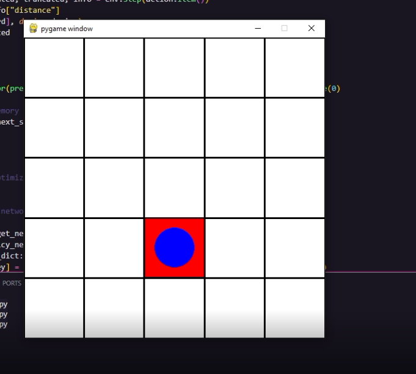

# Gymnasium Examples
Some simple examples of Gymnasium environments and wrappers.
For some explanations of these examples, see the [Gymnasium documentation](https://gymnasium.farama.org).

### Environments
This repository hosts the examples that are shown [on the environment creation documentation](https://gymnasium.farama.org/tutorials/gymnasium_basics/environment_creation/).
- `GridWorldEnv`: Simplistic implementation of gridworld environment

### Wrappers
This repository hosts the examples that are shown [on wrapper documentation](https://gymnasium.farama.org/api/wrappers/).
- `ClipReward`: A `RewardWrapper` that clips immediate rewards to a valid range
- `DiscreteActions`: An `ActionWrapper` that restricts the action space to a finite subset
- `RelativePosition`: An `ObservationWrapper` that computes the relative position between an agent and a target
- `ReacherRewardWrapper`: Allow us to weight the reward terms for the reacher environment

### Contributing
If you would like to contribute, follow these steps:
- Fork this repository
- Clone your fork
- Set up pre-commit via `pre-commit install`

PRs may require accompanying PRs in [the documentation repo](https://github.com/Farama-Foundation/Gymnasium/tree/main/docs).


## Installation

To install your new environment, run the following commands:

```{shell}
cd gymnasium_env
pip install -e .
```

# SS


# Video
https://drive.google.com/file/d/1ocoCuClw6xk2ZlmmV10q4d_BtlPSYitY/view?usp=sharing

# Cara run
python dqn.py

# Penjelasan Reinforcement Learning
Sebenarnya pada dasarnya reinforcement learning cuman kyk metode belajar dimana agent AI mempelajari melakukan suatu kasus melalui trial dan error dan ketika berhasil nanti dapet semacam reward, reinforcement learning sendiri memiliki beberapa metode misalnya DQN sama ada lagi namanya PPO, bedanya itu kalo DQN dia kyk menilai bedasarkan nilai Q atau istilahnya keuntungan yg didapat jadi agent akan melakukan pergerakan berdasarkan itu, sedangkan PPO dia menggunakan probabilitas dimana agent akan menghitung probabilitas pergerakannya pada kasus grid world ini, misalkan ke kiri kemungkinan dapet reward itu 70% sedangkan ke kanan adalah 25% maka agent akan memilih arah kiri pada metode PPO ini,
Di kasus gridworld ini saya menggunakan DQN karena PPO sebenernya agak ribet buat kasus ini sama disuruhnya DQN. Cara DQNnya kerja itu tuh kyk pertama dia ambil state random dulu terus intinya tuh ada suatu fungsi Q dan kita ingin optimasi itu makanya kita perlu mencari input maksimum dari fungsi Q tersebut, inputnya disini sepaham sya itu kyk gerak ke kanan/kiri/bawah/atas dsb, tapi disini karena saya ngikutin dokumentasi pytorch maka jadinya membuat neural network alasannya karena emang kita gatau fungsi Q itu sebenarnya apaan jadi kita pake prediksi dari fungsi Q tersebut saja, dan pada umumnya nanti perhitungan Q valuenya kyk gini

Q(s,a)=r+γ * argmax​Q(s′,a′)

dimana r adalah reward, y adalah semacam bobot dan argmax itu buat nyari nilai a yang menghasilkan fungsi Q maksimal, dan selisih antara Q dan rumus di atas adalah error. pas melatih network menggunakan huberloss, tidak saya tulis karena tidak bisa, intinya buat cari tau seberapa salah sih prediksi nilai Qnya
nah disini kemaren saya modif dikit kode pytorch karena lingkarannya agak tolol, jadinya saya otak atik sedikit di perhitungan Q valuenya dimana nanti reward akan dikurangi oleh 0.01 * jumlah step yang diambil, hal ini dikarenakan dengan penambahan restriksi seperti itu dia belajarnya jadi lebih terkontrol, kemudian saya modif pada saat bagian perhitungan pergi kemananya menjadi semacam double DQN gitu, jadi intinya dia kayak ngecek array policy net bagusnya ke arah mana, lalu melalui data di target net dia akan menilai apakah benar itu yang terbaik, jadinya mesin tidak asal asalan geraknya dan jadi lebih cepat belajarnya
